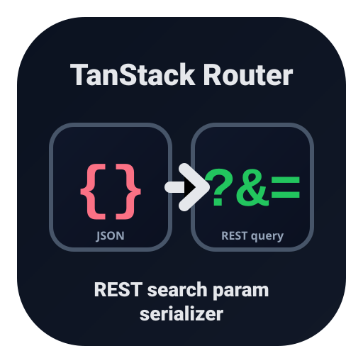

# tanstack-router-rest-search-serializer

[](https://github.com/usapopopooon/tanstack-router-rest-search-param-serializer/actions/workflows/ci.yml)
[](https://www.npmjs.com/package/tanstack-router-rest-search-serializer)
[](https://opensource.org/licenses/MIT)

<p align="center">
  
</p>

> **Note**: This is an unofficial community package, not affiliated with TanStack.

A REST API compliant search param serializer for [TanStack Router](https://tanstack.com/router).

Instead of using `JSON.stringify` / `JSON.parse`, this serializer uses the `URLSearchParams` format that conforms to REST API specifications.

## Why this package?

TanStack Router serializes search parameters as JSON by default. While this works well for internal application state, it causes issues when integrating with external systems:

- **External system compatibility**: URLs like `?userCode=%22123%22` (JSON-encoded string) are difficult for external tools and APIs to generate
- **Type mismatches**: Backend APIs expect standard query string formats, not JSON-encoded values
- **Non-standard format**: Deviates from the industry-standard `application/x-www-form-urlencoded` format

This package provides a REST API compliant serializer that uses the standard `URLSearchParams` format, making URLs human-readable and compatible with any HTTP client or external system.

For more details, see the [blog post (Japanese)](https://zenn.dev/litalico/articles/69601d3c296a89).

## Table of Contents

- [Why this package?](#why-this-package)
- [Features](#features)
- [Installation](#installation)
- [Quick Start](#quick-start)
- [Differences from TanStack Router Default](#differences-from-tanstack-router-default)
- [Supported Formats](#supported-formats)
- [Custom Serializer](#custom-serializer)
  - [Feature Options](#feature-options)
  - [JSON Fallback](#json-fallback)
  - [Presets](#presets)
- [Zod Helpers](#zod-helpers)
  - [commaSeparatedArray](#commaseparatedarray)
  - [joinCommaArray](#joincommaarray)
- [Usage with Route Definition](#usage-with-route-definition)
- [Limitations](#limitations)
- [TypeScript](#typescript)
- [Requirements](#requirements)
- [License](#license)
- [Contributing](#contributing)

## Features

- REST API compliant URL format (no JSON encoding)
- Supports comma-separated arrays (`?ids=1,2,3`)
- Supports Rails-style nested objects (`?user[name]=john`)
- Supports PHP-style arrays (`?ids[]=1&ids[]=2`)
- Automatic boolean string conversion (`"true"` → `true`)
- Customizable feature options
- TypeScript support
- Zero dependencies (except peer dependency on zod for helpers)

## Installation

```bash
npm install tanstack-router-rest-search-serializer
# or
pnpm add tanstack-router-rest-search-serializer
# or
yarn add tanstack-router-rest-search-serializer
```

## Quick Start

```tsx
import {
  parseSearchParams,
  stringifySearchParams,
} from 'tanstack-router-rest-search-serializer'

// Set globally in createRouter
const router = createRouter({
  routeTree,
  parseSearch: parseSearchParams,
  stringifySearch: stringifySearchParams,
})
```

## Differences from TanStack Router Default

By default, TanStack Router encodes search parameters as JSON.

**Parse (URL → Object):**

| URL                            | TanStack Router Default      | This Serializer                              |
| ------------------------------ | ---------------------------- | -------------------------------------------- |
| `?foo=bar`                     | `{ foo: 'bar' }`             | `{ foo: 'bar' }`                             |
| `?count=123`                   | `{ count: 123 }` (number)    | `{ count: '123' }` (string)                  |
| `?code=%22123%22` (`"123"`)    | `{ code: '123' }` (3 chars)  | `{ code: '"123"' }` (5 chars, with quotes)   |
| `?active=true`                 | `{ active: true }` (boolean) | `{ active: true }` (boolean)                 |
| `?ids=%5B%221%22%2C%222%22%5D` | `{ ids: ['1', '2'] }`        | `{ ids: ['["1"', '"2"]'] }` (split by comma) |
| `?ids=1,2`                     | `{ ids: '1,2' }` (string)    | `{ ids: ['1', '2'] }`                        |
| `?foo=`                        | `{ foo: '' }` (empty string) | `{ foo: '' }` (empty string)                 |

**Stringify (Object → URL):**

| Data                         | TanStack Router Default                                   | This Serializer                            |
| ---------------------------- | --------------------------------------------------------- | ------------------------------------------ |
| `{ foo: 'bar' }`             | `?foo=bar`                                                | `?foo=bar`                                 |
| `{ count: 123 }`             | `?count=123`                                              | `?count=123`                               |
| `{ code: '123' }`            | `?code=%22123%22` (`"123"`)                               | `?code=123`                                |
| `{ active: true }`           | `?active=true`                                            | `?active=true`                             |
| `{ ids: ['1', '2'] }`        | `?ids=%5B%221%22%2C%222%22%5D` (`["1","2"]`)              | `?ids=1%2C2` (`1,2`)                       |
| `{ user: { name: 'john' } }` | `?user=%7B%22name%22%3A%22john%22%7D` (`{"name":"john"}`) | `?user%5Bname%5D=john` (`user[name]=john`) |

**Key Differences:**

- **Numbers**: TanStack Router preserves type, this serializer converts to string
- **Strings**: TanStack Router JSON encodes, this serializer keeps as-is
- **Arrays**: TanStack Router uses JSON format, this serializer uses comma-separated
- **Nested Objects**: TanStack Router uses JSON format, this serializer uses Rails-style
- **Empty Strings**: Both preserve empty string `''` as-is
  - Comma-separated format cannot distinguish between empty array `[]` and empty string `''`
  - Empty values like `?ids=` are parsed as empty string `''`

## Supported Formats

| Format                 | Query String             | Parse Result                     |
| ---------------------- | ------------------------ | -------------------------------- |
| Standard               | `?foo=bar`               | `{ foo: 'bar' }`                 |
| Boolean strings        | `?active=true`           | `{ active: true }`               |
| Comma-separated arrays | `?ids=1,2,3`             | `{ ids: ['1', '2', '3'] }`       |
| PHP-style arrays       | `?ids[]=1&ids[]=2`       | `{ ids: ['1', '2'] }`            |
| Duplicate key arrays   | `?ids=1&ids=2`           | `{ ids: ['1', '2'] }`            |
| Nested objects         | `?user[name]=john`       | `{ user: { name: 'john' } }`     |
| Objects in arrays      | `?items[0][name]=apple`  | `{ items: [{ name: 'apple' }] }` |
| Numeric index arrays   | `?items[0]=a&items[1]=b` | `{ items: ['a', 'b'] }`          |

## Custom Serializer

You can create a custom serializer by selecting specific features.

```tsx
import {
  createSerializer,
  SIMPLE_FEATURES,
} from 'tanstack-router-rest-search-serializer'

// Simple features only (standard format + boolean conversion)
const simple = createSerializer(SIMPLE_FEATURES)

// Select individual features
const custom = createSerializer({
  commaSeparatedArrays: true,
  booleanStrings: true,
  nestedObjects: false,
  phpArrays: false,
  duplicateKeyArrays: true,
  numericIndexArrays: false,
})
```

### Feature Options

| Option                 | Default | Description                                                    |
| ---------------------- | ------- | -------------------------------------------------------------- |
| `commaSeparatedArrays` | `true`  | Parse comma-separated arrays                                   |
| `booleanStrings`       | `true`  | Convert `"true"` / `"false"` to boolean                        |
| `nestedObjects`        | `true`  | Rails-style nested objects                                     |
| `phpArrays`            | `true`  | PHP-style arrays `ids[]=1`                                     |
| `duplicateKeyArrays`   | `true`  | Duplicate key arrays `ids=1&ids=2`                             |
| `numericIndexArrays`   | `true`  | Numeric index arrays `items[0]=a`                              |
| `jsonFallback`         | `false` | Parse JSON-encoded values for backward compatibility           |

### JSON Fallback

Enable `jsonFallback` to parse JSON-encoded values from TanStack Router's default format. This is useful for backward compatibility when migrating from JSON to REST format.

```tsx
const { parseSearchParams, stringifySearchParams } = createSerializer({
  jsonFallback: true,
})

// Parses TanStack Router default JSON format:
// ?ids=%5B%221%22%2C%222%22%5D (["1","2"]) → { ids: ['1', '2'] }
// ?code=%22123%22 ("123") → { code: '123' }
// ?user=%7B%22name%22%3A%22john%22%7D ({"name":"john"}) → { user: { name: 'john' } }
```

### Presets

- **`FULL_FEATURES`**: All features enabled except `jsonFallback`
- **`SIMPLE_FEATURES`**: Standard format + boolean conversion only

## Zod Helpers

When using TanStack Router's `validateSearch` with Zod, these helpers solve format compatibility issues.

**Why are these helpers needed?**

The comma-separated format cannot distinguish between an empty array `[]` and an empty string `''`. When parsing `?ids=`, this serializer returns `''` (empty string), but Zod's `z.array()` expects an array. The `commaSeparatedArray` helper handles this conversion.

### `commaSeparatedArray`

Handles empty string `''` → `[]` conversion for array fields:

```tsx
import { z } from 'zod'
import { commaSeparatedArray } from 'tanstack-router-rest-search-serializer/zod-helpers'

const searchSchema = z.object({
  ids: commaSeparatedArray(z.string()).optional(),
})

// ?ids=1,2,3 → { ids: ['1', '2', '3'] }
// ?ids=      → { ids: [] }
```

### `joinCommaArray`

Joins arrays back into comma-separated strings. Use when you want certain parameters to remain as strings containing commas:

```tsx
import { z } from 'zod'
import { joinCommaArray } from 'tanstack-router-rest-search-serializer/zod-helpers'

const searchSchema = z.object({
  // Keep as string containing commas
  freeText: joinCommaArray(z.string()).optional(),
})

// ?freeText=a,b,c → { freeText: 'a,b,c' } (string, not array)
```

## Usage with Route Definition

Example of using with TanStack Router's route definition and Zod validation:

```tsx
import { createFileRoute } from '@tanstack/react-router'
import { z } from 'zod'
import {
  parseSearchParams,
  stringifySearchParams,
} from 'tanstack-router-rest-search-serializer'
import { commaSeparatedArray } from 'tanstack-router-rest-search-serializer/zod-helpers'

const searchSchema = z.object({
  q: z.string().optional(),
  page: z.coerce.number().default(1),
  tags: commaSeparatedArray(z.string()).optional(),
  active: z.boolean().optional(),
})

export const Route = createFileRoute('/search')({
  validateSearch: searchSchema,
})

// URL: /search?q=hello&page=2&tags=react,typescript&active=true
// Result: { q: 'hello', page: 2, tags: ['react', 'typescript'], active: true }
```

## Limitations

- **Type coercion**: All values are parsed as strings. Use `z.coerce.number()` for numeric values.
- **Empty arrays**: Cannot distinguish between `[]` and `''`. Use `commaSeparatedArray` helper.
- **Commas in values**: Values containing commas will be split into arrays. Use `joinCommaArray` helper if needed.
- **Deep nesting**: While supported, deeply nested structures may result in long URLs.

## TypeScript

This package is written in TypeScript and includes type definitions.

## Requirements

- TanStack Router v1.x
- TypeScript 5.0+ (if using TypeScript)

## Related

- [TanStack Router](https://tanstack.com/router) - Type-safe routing for React

## License

MIT

## Contributing

Issues and pull requests are welcome on [GitHub](https://github.com/usapopopooon/tanstack-router-rest-search-param-serializer).
